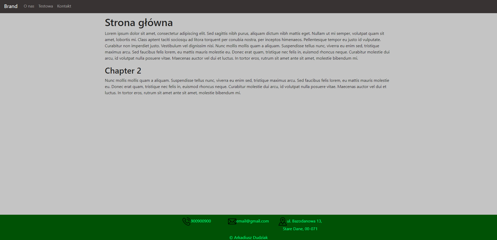
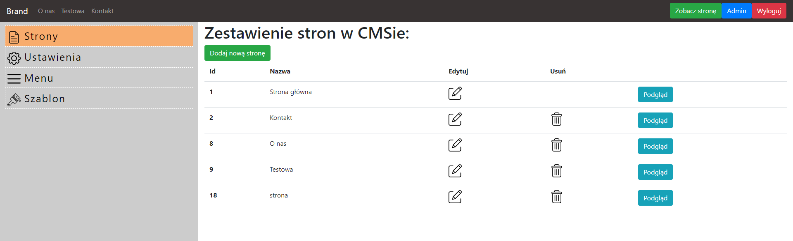
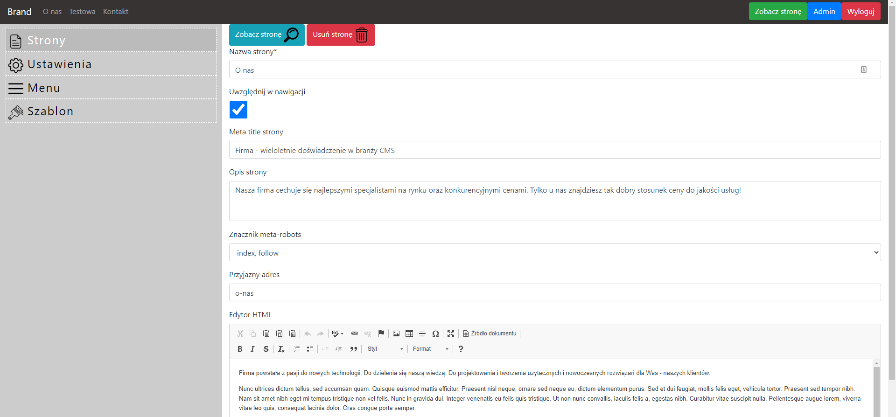
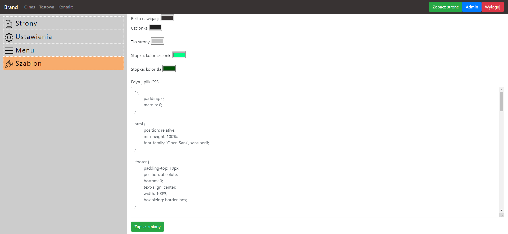

## How to run:
1. download repository
2. create database from custom-cms.sql file
3. launch local server for example through XAMPP
4. enter project folder root path in your browser

### You can edit pages through admin panel:
- write /admin after main page url address
- login: admin, password: admin

You can also configure DocumentRoot in XAMPP Apache httpd.conf file to root folder of project.
CMS should be available under "localhost" address.

### Features:
- add, edit, remove pages
- configure if page should be visible in navigation menu
- reorder pages in navigation menu
- configure contact information in footer
- edit layout (customize colors or edit css file through admin panel)

### Screenshots:
I. Example main page:

II. All pages in CMS view:

III. Edit page:

IV: Layout editor:

